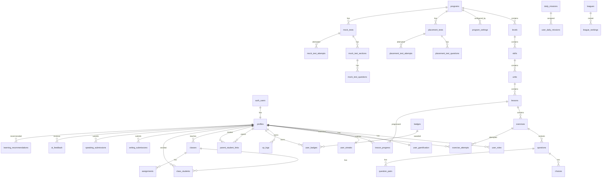

# CAMBA Database ERD

## Entity Relationship Diagram



## Content Hierarchy (Generic Multi-Program)

```
Program (e.g., Cambridge English, IELTS, Math)
  └── Level (e.g., Flyers, Band 5, Grade 6)
        └── Skill (e.g., Reading, Algebra)
              └── Unit (e.g., Unit 1)
                    └── Lesson (e.g., Lesson 1)
                          └── Exercise (e.g., Multiple Choice Quiz)
                                └── Question
                                      └── Choice / Pair
```

## Core Tables Summary

| Table | Purpose |
|-------|---------|
| `profiles` | User profile extending Supabase Auth |
| `user_roles` | Role assignments (student, parent, teacher, admin) |
| `programs` | Top-level learning programs |
| `levels` | Program levels (exam levels, grades, bands) |
| `skills` | Skill categories within levels |
| `units` | Content units within skills |
| `lessons` | Individual lessons with progressive unlock |
| `exercises` | Exercise content with type and scoring |
| `questions` | Question bank linked to exercises |
| `choices` | Answer choices for questions |
| `lesson_progress` | Mastery tracking per user/lesson |
| `exercise_attempts` | Detailed attempt analytics |
| `user_gamification` | XP, level, coins, shield progress |
| `xp_logs` | XP transaction history |
| `badges` / `user_badges` | Achievement system |
| `user_streaks` / `streak_calendar` | Streak tracking |
| `mock_tests` | Full exam simulations |
| `placement_tests` | Level assessment tests |
| `ai_feedback` | AI-generated feedback storage |
| `learning_recommendations` | Adaptive learning suggestions |
| `leagues` / `league_rankings` | Weekly competition |
| `content_translations` | i18n for dynamic content |
| `program_settings` | Program-specific configuration |

## Mastery System

| Level | Name | Description |
|-------|------|-------------|
| 0 | Not Started | Lesson not yet attempted |
| 1 | Beginner | Initial attempt, low accuracy |
| 2 | Developing | Improving performance |
| 3 | Proficient | Ready to unlock next lesson |
| 4 | Mastered | Full mastery achieved |

**Unlock Rule:** Next lesson unlocks when mastery >= 3 (Proficient)

## Role-Based Access

| Role | Access |
|------|--------|
| Student | Own progress, content, gamification |
| Parent | Linked student data, dashboards |
| Teacher | Classes, assignments, student reports |
| Admin | Full content management, users, settings |
